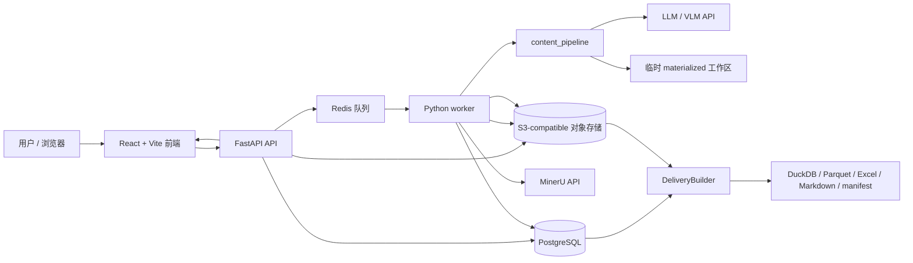
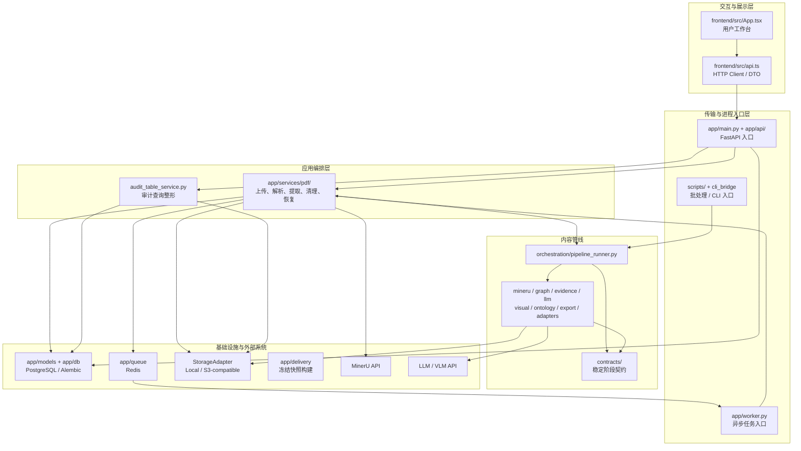
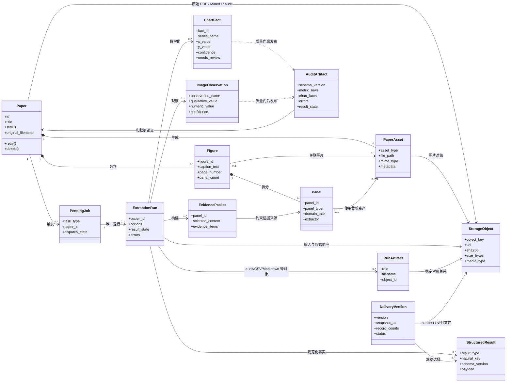

# Extraction Service 架构

> 状态：生产持久化基线（2026-07-11）  
> 适用范围：本仓库的 FastAPI 后端、内容提取管线、React 前端、PostgreSQL、对象存储、Redis 异步任务与冻结交付。  
> 目的：提供可检索的领域与包分层顶层地图，并用可复核评分持续追踪架构差距。本文描述当前实现，而非期望中的未来系统。

## 1. 系统目标、边界与核心约束

### 1.1 系统目标

系统接收论文 PDF 或已有 MinerU 产物，将论文解析为页面、图、面板和图片资产；对数据图执行 LLM/VLM 驱动的结构化提取；保存可审计结果，并通过 API、CSV 和 Web UI 供用户查看与重跑。

成功标准是“可追溯的提取结果”，而不只是生成文本：结果必须能关联到论文、图/面板、原始图片和处理阶段；低可信或伪造坐标不得作为可信 CSV 发布。

### 1.2 系统边界

系统内：PDF 上传与校验、MinerU 调用/产物导入、资产构建、论文与任务状态、内容图构建、证据选择、LLM/VLM 阶段、质量门、审计导出、Web 展示、Redis 队列和 worker 恢复。

系统外：MinerU API、OpenAI-compatible LLM/VLM API、浏览器、PostgreSQL、S3-compatible 对象存储和 Redis 服务本身。认证、聊天、笔记、标签、RAG、Embedding、知识图谱抽取、Obsidian 同步和 OAuth 明确不在当前产品边界内。

### 1.3 核心约束

- 主链路是 LLM/agent-first；不得把临时 OpenCV 采样或 fake/test 坐标重新接回可信输出。
- 生产业务事实位于 PostgreSQL；SQLite 仅用于本地开发、测试和旧数据迁移源。
- PDF、图片、MinerU 产物、模型原始响应和交付文件只能通过 `StorageAdapter` 进入本地或 S3-compatible 对象存储；数据库不保存大对象字节。
- API 只负责请求、查询和入队；长耗时解析与内容提取由 worker 执行。
- Redis 队列消息是轻量任务引用（schema v2：`task_type`、`job_id`），worker 从 PostgreSQL 和对象存储恢复上下文；Redis 不是事实源。
- 每个任务最多对应一个不可变 `ExtractionRun`；显式重试创建新任务/新运行，终态运行不得更新或删除。worker lease 通过 heartbeat 续租，并以 `claim_generation` fencing 阻止旧 owner 提交。
- DuckDB、Parquet、Excel、Markdown 和 manifest 是固定 `snapshot_at` 的不可变交付，不参与在线事务。
- 内容管线以 `content_pipeline/contracts/` 的类型和校验规则为稳定边界；阶段间不得传递无约束字典替代已有契约。
- 依赖和运行命令遵循仓库规则：`uv sync` 管理依赖，命令通过 `uv run` 执行，不使用系统 Python。

## 2. 架构图：系统上下文与运行组件

下图同时表达运行组件、外部依赖和主要调用方向；它是部署与故障定位的第一入口。



部署拓扑由 `docker-compose.yml` 定义为 `api`、`worker`、`postgres`、`redis`、`minio` 与一次性 `minio-init`。API/worker 不依赖共享持久卷；本地 `DATA_DIR` 只承载临时运行状态和开发模式对象。前端通过同源路径或开发代理访问 API。

### 2.1 分层组件架构图



阅读规则：向下箭头表示允许的源码依赖或运行调用。`content_pipeline` 不反向依赖 `app`；Redis 只传任务 ID，PostgreSQL 保存事实，对象存储保存字节。

## 3. 产品领域地图

| 产品领域 | 领域职责 | 核心对象/产物 | 主要实现位置 | 边界说明 |
|---|---|---|---|---|
| 论文接入与生命周期 | 上传、校验、查询、重试、删除论文；维护状态 | `Paper`、上传 PDF、`PaperStatus` | `app/api/papers.py`、`app/services/pdf/upload_service.py`、`cleanup_service.py` | 接收用户意图并发起流程，不实现内容提取算法 |
| 文档解析与资产化 | 调用 MinerU 或导入本地产物，将内容构造成 Figure、Panel、Asset | `Figure`、`Panel`、`PaperAsset`、content list、图片 | `app/services/pdf/parse_service.py`、`artifact_service.py`、`app/services/mineru_*` | 负责“原文到结构化资产”，不负责语义/数值解释 |
| 内容理解与结构化提取 | 规范化块、构图、选证据、分类面板、数字化图表、观察图片 | `DocumentGraph`、`EvidencePacket`、`ChartDigitizationResult`、`ImageObservation` | `content_pipeline/` | 纯管线能力；通过 contracts 输入输出，不直接依赖 Web/API 或 ORM |
| 审计与结果发布 | 同时保留模型原始响应和规范化查询结果，质量门后生成审计/CSV | `ExtractionRun`、`StructuredResult`、对象化 audit/CSV | `content_pipeline/export/`、`app/services/extraction_runs.py`、`app/services/pdf/audit.py` | 原始响应不可替代规范化结果；终态运行不可覆盖 |
| 任务编排与恢复 | 幂等入队、行锁 claim、lease heartbeat/fencing、失败/卡住任务恢复 | Redis `job_id`、`PendingJob`、advisory lock | `app/queue/`、`app/repositories/jobs.py`、`app/worker.py`、`dispatcher.py` | Redis 仅唤醒；数据库任务行与运行事实可恢复完整上下文 |
| 数据交付 | 从固定范围和时间边界构建不可变分析包 | `DeliveryVersion`、DuckDB、Parquet、Excel、Markdown、manifest | `app/delivery/` | 在线库始终是 PostgreSQL；已发布版本不可原地修改 |
| 工作台与结果浏览 | 上传/导入、选择论文、触发单篇或批量任务、轮询状态、浏览图与审计表 | React state、API DTO | `frontend/src/` | 只通过 HTTP 契约访问后端，不读取数据库或数据目录 |

领域交互的主方向：`论文接入 → 文档解析与资产化 → 内容理解与结构化提取 → 审计与结果发布 → 工作台`；任务编排横切前三段，但不得承载领域算法。

### 3.1 领域模型图

下图聚焦业务概念及其关系，不表达数据库表的全部字段。实线表示核心生命周期关系，虚线表示编排或产物消费关系。



领域不变量：

- `Figure`、`Panel`、`PaperAsset` 必须可追溯到 `Paper`；删除论文时需协同清理数据库记录和文件产物。
- `PendingJob` 通过唯一幂等键和 lease 描述一次可 claim 工作；它不能替代 `Paper.status` 或 `ExtractionRun`。
- `StorageObject` 是所有持久字节的稳定引用；同一对象键禁止以不同 SHA-256 覆盖。
- `ExtractionRun` 终态事实、原始响应对象和规范化结果必须共存；失败也必须记录原因。
- `DeliveryVersion` 的唯一版本名、快照边界、record counts 和 manifest 共同定义冻结数据版本。
- `EvidencePacket` 是模型判断的证据边界；图表事实或图片观察不得脱离对应面板/资产来源。
- `ChartFact` 只有通过 schema 校验和质量门后才能进入可信审计/CSV；`needs_review` 与 confidence 必须保留。
- `AuditArtifact` 是一次运行的可审计快照，不应被前端展示逻辑反向修改。

## 4. 包与目录分层地图

| 架构层（外 → 内） | 目录/包 | 职责 | 允许依赖 |
|---|---|---|---|
| 交互与展示层 | `frontend/src/` | UI、轮询、API client、展示 DTO | HTTP API 契约；前端内部组件与工具 |
| 传输与进程入口层 | `app/main.py`、`app/api/`、`app/worker.py`、`scripts/` | HTTP/CLI/worker 入口、参数转换、事务/进程边界 | 应用服务、schemas、config、queue；不得实现核心算法 |
| 应用编排层 | `app/services/pdf/`、`app/services/audit_table_service.py` | 用例编排、状态迁移、锁、解析/提取协调、审计查询 | models、storage、queue、agent adapter、`content_pipeline` 公共入口 |
| 内容管线编排层 | `content_pipeline/orchestration/`、`content_pipeline/cli_bridge.py` | 排列内容提取阶段并聚合结果 | 下列管线能力层和 contracts |
| 内容管线能力层 | `content_pipeline/mineru/`、`graph/`、`evidence/`、`llm/`、`visual/`、`ontology/`、`export/`、`adapters/` | 单一阶段能力及外部模型适配 | `contracts/`；同层依赖应显式且无环 |
| 领域契约与模型层 | `content_pipeline/contracts/`、`app/models/`、`app/schemas.py` | 管线契约、ORM 实体、API DTO | 标准库/框架基础类型；管线 contracts 不得依赖 `app` |
| 基础设施层 | `app/db.py`、`app/config.py`、`app/queue/`、`app/repositories/`、`app/services/storage.py`、`app/services/object_store.py`、`app/delivery/`、部署配置 | PostgreSQL、Alembic、Redis、对象存储、交付与外部 API adapter | 外部库和稳定领域类型；由应用层调用 |
| 验证与说明层 | `tests/`、`docs/`、`prompts/` | 契约/集成/真实数据测试、设计说明、模型提示词 | 可引用被验证对象；生产代码不得依赖本层 |

这里的“层”表达依赖规则，不等同于目录深度。`app/services/pdf/pipeline.py` 是后端到独立内容管线的防腐层；`content_pipeline/` 不应反向导入 `app`。当前 `app/services/extraction/llm_config.py` 依赖 `app.config` 属于后端适配器，而非管线核心。

### 4.1 目录树

以下是面向架构检索的精简树，只展示职责边界；运行数据、缓存、虚拟环境、依赖安装目录和归档文件已省略。

```text
extraction/
├── app/                              # FastAPI 后端与异步 worker
│   ├── main.py                       # HTTP 进程入口、lifespan、路由装配
│   ├── worker.py                     # Redis 消费、恢复与后台执行入口
│   ├── api/
│   │   └── papers.py                 # 论文、图、资产、提取与审计 HTTP API
│   ├── models/                       # SQLAlchemy 领域持久化模型
│   │   ├── paper.py                  # Paper、PaperAsset、ImageExtraction
│   │   ├── figure.py                 # Figure、Panel
│   │   ├── job.py                    # PendingJob / lease / 幂等任务
│   │   └── persistence.py            # Project、StorageObject、ExtractionRun、结果与交付
│   │   └── enums.py                  # 状态枚举
│   ├── services/
│   │   ├── pdf/                      # PDF 用例编排边界
│   │   │   ├── upload_service.py     # 上传、校验、入队
│   │   │   ├── parse_service.py      # MinerU 解析与资产构建
│   │   │   ├── pipeline.py           # 后端到 content_pipeline 的防腐层
│   │   │   ├── artifact_service.py   # 本地 MinerU 产物导入
│   │   │   ├── audit.py              # 审计定位与摘要
│   │   │   ├── dispatcher.py         # 卡住任务恢复与重派
│   │   │   ├── locks.py              # 论文级运行锁
│   │   │   └── cleanup_service.py    # 论文与产物清理
│   │   ├── agent/                    # 后端侧 LLM adapter
│   │   ├── extraction/               # LLM/VLM 配置桥接
│   │   ├── mineru_parser.py          # MinerU API/产物解析
│   │   ├── mineru_asset_builder.py   # Figure/Panel/Asset 构建
│   │   ├── audit_table_service.py    # 审计记录到 UI 表格
│   │   ├── storage.py                # Local/S3 StorageAdapter
│   │   ├── object_store.py           # 对象元数据登记
│   │   └── extraction_runs.py        # 不可变运行与规范化结果
│   ├── repositories/                 # 事务与并发持久化边界
│   ├── delivery/                     # 冻结交付构建器与 CLI
│   ├── queue/
│   │   ├── contracts.py              # 版本化队列消息契约
│   │   └── redis_queue.py            # Redis 队列 adapter
│   ├── db.py                         # Session、建表、临时兼容迁移
│   ├── config.py                     # 环境变量与运行路径
│   └── schemas.py                    # API DTO / 响应映射
├── content_pipeline/                 # 后端无关的内容提取核心
│   ├── orchestration/                # 总管线与阶段顺序
│   ├── contracts/                    # 稳定数据契约、错误与质量规则
│   ├── mineru/                       # 内容块规范化、图片路径、面板标记
│   ├── graph/                        # 文档、布局、Figure/Panel 图
│   ├── evidence/                     # 上下文选择、证据包、去重
│   ├── llm/                          # Phase runner、模型 client、阶段实现
│   ├── visual/                       # 图表质量门、矩阵与视觉上下文
│   ├── adapters/                     # 模型 payload → 领域 contract
│   ├── ontology/                     # 单位/指标 ontology 与 gap 处理
│   ├── export/                       # 审计和 CSV 导出
│   └── cli_bridge.py                 # CLI/后端共享公共入口
├── frontend/                         # React + Vite 工作台
│   └── src/
│       ├── main.tsx                  # 浏览器入口
│       ├── App.tsx                   # 主工作流与轮询状态
│       ├── api.ts                    # 后端 API adapter 与 DTO
│       ├── components.tsx            # 结果与资产组件
│       ├── utils.ts                  # 展示/状态辅助逻辑
│       └── styles.css                # 全局样式
├── prompts/                          # LLM/VLM 提示词及领域 extractor
├── scripts/                          # CLI、批处理、恢复和演示入口
├── tests/                            # 契约、集成、真实 fixture 与 E2E 测试
├── docs/                             # 详细设计、ontology 与归档计划
├── migrations/                       # Alembic 正式数据库迁移
├── Dockerfile                        # API/worker 共用镜像
├── docker-compose.yml                # api + worker + redis 运行拓扑
├── pyproject.toml                    # uv 项目与依赖声明
├── uv.lock                           # uv 锁定依赖
├── requirements.txt                  # Docker 依赖兼容输入
└── ARCHITECTURE.md                   # 顶层架构地图与成熟度账本
```

目录新增原则：新产品能力先确定所属领域和架构层；只有形成独立责任、稳定接口或不同变化节奏时才新增包，不能仅因文件变大就制造无业务含义的目录。

## 5. 主要入口、数据流和依赖方向

### 5.1 主要入口

- HTTP：`app.main:app`；论文路由集中在 `app/api/papers.py`。
- Worker：`app.worker:main`，消费 `paper_parse` 和 `chart_only_run`。
- 内容管线：`content_pipeline.orchestration.pipeline_runner.run_content_graph_pipeline`；兼容入口为 `content_pipeline.cli_bridge.run_content_pipeline`。
- 前端：`frontend/src/main.tsx` → `App.tsx` → `api.ts`。
- 运维/批处理：`scripts/cli.py`、`scripts/run_pipeline_demo.py`、`scripts/run_all_papers.py` 等；脚本不是被生产包反向调用的库。

### 5.2 上传与解析流

`POST /papers/upload` → PDF 校验 → `StorageAdapter` 上传 PDF + `storage_objects` 登记 → Paper/幂等 PendingJob 事务提交 → Redis 仅发送 `job_id` → worker 行锁/lease claim → materialize PDF → MinerU → 对象化 raw/content/layout/images → Figure/Panel/Asset 元数据提交。

### 5.3 数据图提取流

`POST /papers/{id}/chart-only/run`（或批量入口）→ 幂等任务 → worker claim + PostgreSQL advisory lock → 创建 `ExtractionRun(running)` → 从对象引用重建临时输入 → `content_pipeline` → 质量门 → 原始模型响应/全部输出上传对象存储 + `StructuredResult` 事务写入 → 运行终态与任务完成 → 前端按对象化 audit 轮询展示。任何重试都会创建新任务/新运行。

### 5.4 冻结交付流

`uv run python -m app.delivery.cli --version …` → 锁定唯一 `DeliveryVersion` 与 `snapshot_at` → 校验 project/paper/status scope → PostgreSQL `REPEATABLE READ` 读取终态 runs/results → 稳定排序并生成 Parquet、DuckDB、Excel、Markdown → 逐文件 SHA-256 → 上传对象存储 → 写 `manifest.json` → 发布终态。发布后 ORM 与数据库 trigger 均禁止修改版本事实。

### 5.5 依赖方向

```text
frontend → HTTP API → app application services → content_pipeline public API
                              ↓                         ↓
                    DB / queue / storage        contracts ← capabilities
                              ↓
                            worker
```

依赖箭头指“调用方依赖被调用方”。状态和产物回流不改变源码依赖方向。

## 6. 跨层调用规则与禁止依赖

### 6.1 允许规则

1. 前端只能通过 `frontend/src/api.ts`（或后续等价 API adapter）访问后端。
2. API handler 只做协议转换、权限/输入检查、调用应用服务和响应映射；事务状态变更归应用服务。
3. Worker 只解析队列 payload、建立进程/事务边界并调用应用服务。
4. 后端通过 `content_pipeline` 的公共入口和 `contracts` 集成管线，不深链路调用内部 phase 实现。
5. 管线能力包依赖 `contracts`；跨能力共享数据必须先成为契约，不以循环 import 或任意字典传递。
6. 外部服务、DB、Redis 和对象存储访问集中在基础设施 adapter；核心转换应可用内存输入进行测试。
7. `tests/`、`docs/`、`scripts/` 可以依赖生产包，生产包不得反向依赖它们。

### 6.2 禁止依赖

- 禁止 `content_pipeline/** → app/**`；否则独立管线被 Web/ORM 运行环境绑死。
- 禁止 `contracts/** → orchestration|llm|visual|app`；契约必须保持最低层。
- 禁止 `frontend/**` 读取对象存储、PostgreSQL/SQLite 或 Redis。
- 禁止 API route 直接调用 MinerU/LLM 或执行长耗时管线。
- 禁止 worker/API 把 Redis 当成任务真相源；必须能由持久状态恢复或重派。
- 禁止业务服务直接拼持久绝对路径；第三方库需要路径时只能通过 adapter materialize 临时工作区。
- 禁止覆盖终态 `ExtractionRun` 或已发布 `DeliveryVersion`；禁止把 DuckDB/Parquet 当在线主库。
- 禁止绕过 quality gate 直接把模型原始输出发布为可信 CSV。
- 禁止新增第二套同义 DTO/contract 而没有迁移计划；公共术语以 `contracts/` 和 ORM/API schema 为准。
- 禁止生产模块导入 `tests/`、归档计划或一次性 `scripts/`。

建议在 CI 中用 import-linter、简短 AST 检查或等价工具自动执行上述边界。

## 7. 架构决策记录

| ID | 决策 | 状态 | 理由 | 代价/后续约束 |
|---|---|---|---|---|
| ADR-001 | 产品聚焦 PDF 接入与图片/数据图提取 | 已采纳 | README 明确排除旧系统的 auth、RAG 等能力，控制迁移范围 | 新需求必须先判断是否属于边界；不得偷偷恢复旧系统耦合 |
| ADR-002 | API 与 worker 分进程、通过 Redis 解耦 | 已采纳 | MinerU 和 LLM/VLM 是长耗时且可失败的外部调用，不能阻塞 HTTP | 必须维护幂等、锁、恢复、重派和状态一致性 |
| ADR-003 | SQLite + 共享文件卷作为早期持久化 | 已废弃 | 早期部署简单，但无法满足多 worker、远程对象和不可变历史 | 仅作为迁移源/本地测试兼容，不得用于生产主存储 |
| ADR-004 | `content_pipeline` 作为后端无关的独立包 | 已采纳 | 便于 CLI、测试和后端复用，隔离 ORM/Web 框架 | 必须禁止反向依赖 `app`，并稳定公共入口与 contracts |
| ADR-005 | 契约优先、证据可追溯、质量门后发布 | 已采纳 | LLM 输出非确定，结构校验与证据链是可信结果的必要条件 | 契约演进需要兼容策略、真实 fixture 和审计版本信息 |
| ADR-006 | 前端轮询任务状态 | 已采纳（临时） | 实现简单，适配当前 Redis worker 与任务量 | 任务量增长后会产生重复请求；再评估 SSE/WebSocket |
| ADR-007 | 启动时 `create_all` + 兼容列迁移 | 已废弃 | 早期 schema 演进方式缺少正式历史 | 已由 Alembic `0001`/`0002` 替代 |
| [ADR-008](docs/adr/0008-postgresql-online-database.md) | PostgreSQL 作为在线业务数据库 | 已采纳 | 行级并发、事务约束、lease/claim 与多副本恢复 | 需生产备份、监控和迁移演练 |
| [ADR-009](docs/adr/0009-object-storage-for-artifacts.md) | 对象存储保存大型/非结构化产物 | 已采纳 | 去除共享目录和数据库 BLOB，建立稳定校验引用 | 需生命周期、版本、加密和垃圾回收策略 |
| [ADR-010](docs/adr/0010-duckdb-parquet-delivery-snapshots.md) | DuckDB + Parquet 仅作冻结交付 | 已采纳 | 离线分析友好且不牺牲在线事务模型 | 发布版本不可覆盖；跨依赖版本以数据等价而非字节相同为准 |

新增重要决策时，在本表追加；若包含复杂权衡，可在 `docs/adr/NNNN-*.md` 写完整 ADR，并从此处链接。

## 8. 成熟度评分

### 8.1 量表与方法

每项按 0–5 分评分：0 不存在；1 临时/主要靠个人；2 已实现但边界或验证薄弱；3 已定义且大部分有测试；4 自动执行、可观测且有明确责任；5 有量化目标、持续演进并验证效果。

评分由五类证据综合：边界清晰度 25%、契约/数据一致性 20%、测试与自动化 25%、可观测/恢复 15%、文档与责任 15%。分数是架构治理指标，不等同于功能价值或代码作者表现。

当前证据（2026-07-11）：FastAPI/React 主链路保留；Alembic 可从零创建 PostgreSQL/SQLite 兼容 schema；Local/S3 adapter、任务幂等 claim、运行不可变、交付 manifest/checksum 均有测试。PostgreSQL 集成测试需要 `TEST_POSTGRES_URL`；当前开发机没有 PostgreSQL/Docker daemon，因此最终证据必须区分“测试已提供”和“实际 PostgreSQL 已执行”。

### 8.2 产品领域评分

| 领域 | 分数 | 评分依据 | 当前差距 | 下一步改进措施 | 负责人 |
|---|---:|---|---|---|---|
| 论文接入与生命周期 | 3.0 | 有 API、服务、ORM 状态和上传/重试/删除测试 | 路由文件职责偏大；状态机未集中声明；API 契约未版本化 | 提取 lifecycle service/状态迁移表；补重复提交与删除竞态测试 | 待指定（建议：后端负责人） |
| 文档解析与资产化 | 3.0 | MinerU adapter、产物导入、Figure/Panel/Asset 构建职责可识别 | 外部 API 失败矩阵、幂等键和产物版本说明不足 | 定义解析作业幂等契约；记录 MinerU 版本/输入哈希；补超时与部分产物恢复测试 | 待指定（建议：解析域负责人） |
| 内容理解与结构化提取 | 3.5 | 独立包、contracts、图/证据/LLM/质量门分包，相关契约测试较多 | 阶段 API 较多；模型降级和成本指标不足 | 固化公共 phase protocol；增加每阶段质量/成本/延迟指标 | `@extraction/content-pipeline` |
| 审计与结果发布 | 3.5 | audit/CSV 均有版本字段，run/model/prompt 元数据贯穿 JSON 与 CSV | 缺少历史 golden-file 兼容矩阵和 schema registry | 做 golden-file 兼容测试，形成向后兼容政策 | `@extraction/data-quality` |
| 任务编排与恢复 | 3.5 | Redis v2 只传 job ID；PostgreSQL claim/lease、幂等键、advisory lock、恢复/重派均有实现 | 仍缺实际多进程 PostgreSQL 压测、重试预算和队列指标 | 在 CI/预发执行并发 claim 与 worker kill/restart 演练 | `@extraction/platform` |
| 工作台与结果浏览 | 2.5 | API client 集中、状态轮询和主要业务操作齐全 | `App.tsx` 状态与流程集中；无前端测试；错误/空态契约分散 | 拆分页面状态 hooks；补 API contract 与关键用户流测试；统一错误模型 | 待指定（建议：前端负责人） |

### 8.3 架构层评分

| 架构层 | 分数 | 评分依据 | 当前差距 | 下一步改进措施 | 负责人 |
|---|---:|---|---|---|---|
| 交互与展示层 | 2.5 | React/Vite 结构简单，API adapter 集中 | 单体组件、无自动化 UI 测试、轮询策略散落 | 模块化 workspace；增加 Vitest/浏览器 smoke tests | 待指定（前端） |
| 传输与进程入口层 | 2.5 | API、worker、CLI 入口明确 | `papers.py` 过大；handler 含较多结果整形；入口契约未自动盘点 | 按资源/用例拆路由；OpenAPI contract test；限制 handler 复杂度 | 待指定（后端） |
| 应用编排层 | 3.0 | PDF 服务子包形成用例边界，具备锁与恢复 | 服务间依赖和事务边界未文档化/自动检查 | 为每个用例标注事务与幂等边界；增加应用服务测试 | 待指定（后端） |
| 内容管线编排层 | 3.5 | 有单一 runner 与 CLI bridge，阶段顺序可定位 | runner 仍是高耦合汇聚点，阶段可插拔契约不足 | 建立统一 Phase interface、运行上下文和阶段遥测 | 待指定（内容管线） |
| 内容管线能力层 | 3.5 | 职责细分，质量门/adapter/证据处理可见 | 包间依赖规则仅靠约定；部分能力缺孤立测试 | 加 import boundary CI；逐包列 public API 和测试矩阵 | 待指定（内容管线） |
| 领域契约与模型层 | 4.0 | contracts 丰富，队列/audit/CSV/run metadata 有显式版本和映射测试 | API DTO、ORM、管线 contract 的完整映射策略仍未集中说明 | 建立契约 registry 与 golden-file 兼容测试 | `@extraction/engineering` |
| 基础设施层 | 3.5 | PostgreSQL/Alembic、Redis、Local/S3 adapter、MinIO Compose、对象校验和交付构建边界明确 | 当前机器未实际启动完整 Compose/PostgreSQL；密钥、指标、备份恢复仍需部署验证 | CI 启动完整栈；健康/就绪检查、备份演练和对象生命周期策略 | `@extraction/platform` |
| 验证与说明层 | 3.0 | 全量测试绿色、边界检查、CODEOWNERS 和责任矩阵已纳入仓库 | 仍缺文档链接检查和真实外部服务验证 | 增加文档链接检查；定期执行 Redis/MinerU/LLM 集成演练 | `@extraction/engineering` |

## 9. 评分历史与差距追踪

历史只追加、不覆盖；同日修订用备注解释。总分是各领域/层的简单平均，便于趋势观察，不用于掩盖单项风险。

| 日期 | Git 基线 | 产品领域均分 | 架构层均分 | 关键变化/证据 | 评审人 |
|---|---|---:|---:|---|---|
| 2026-07-11 | `42e6ee93f961` + 未提交的本文 | 2.9 | 2.9 | 首次基线；166 文件；全量 pytest 因遗留模块引用在收集阶段失败；无明确 owner | Codex 初评，待团队确认 |
| 2026-07-11 | 当前工作分支 | 3.1 | 3.2 | 93 passed、1 skipped；迁移旧测试引用；新增 CODEOWNERS/边界 CI；队列、audit/CSV/run metadata 版本化；Alembic `0001_initial_schema` 生效 | Codex，待团队确认 GitHub team alias |
| 2026-07-11 | 当前工作分支（持久化升级） | 3.4 | 3.5 | PostgreSQL 生产 schema、Local/S3、不可变 ExtractionRun、规范化结果、任务 claim/lease、冻结交付与 ADR；实际命令结果见本次交付报告 | Codex，待生产环境复核 |

每个改进项建议进入 issue/计划系统，并至少包含：对应领域/层、当前分、目标分、验收证据、负责人、截止日期。只有验收证据落库后才能上调评分。

## 10. 文档维护机制

### 10.1 所有权与评审

- 文档 owner：`@extraction/engineering`。
- 各表中的领域/层 owner 对对应内容和评分证据负责；GitHub team alias 必须在组织中存在，否则 CODEOWNERS 只是一份待配置清单。
- 架构变更 PR 由受影响领域 owner 与至少一名相邻层 owner 评审。

### 10.2 更新触发条件

出现以下任一情况，必须在同一 PR 更新本文：

- 新增/删除顶层包、部署服务、数据库/队列/对象存储或外部模型供应商；
- 新增产品领域、关键业务流、HTTP/worker/CLI 入口或跨层依赖；
- 修改 Paper/Job 状态机、队列 payload、公共 pipeline contract、audit/CSV schema；
- 改变数据落盘位置、保留/删除策略、迁移方式、重试/锁/恢复策略；
- 采纳、替换或废弃架构决策；
- 修复某项差距并请求提高成熟度评分；
- 每季度例行评审，即使架构没有显著变化。

### 10.3 更新步骤与完成定义

1. 更新受影响的领域、层、入口、数据流、依赖规则或 ADR。
2. 重新运行文件/依赖盘点和测试；记录命令、日期及成功/失败结果。
3. 用量表重新评分，只对有新证据的项目改分。
4. 在评分历史追加一行，填写 Git SHA、变化、证据和评审人。
5. 检查 owner、行动项和链接是否仍有效；关闭已完成差距或写出后续项。

文档完成定义：地图与源码一致；依赖规则可判定；每个领域和层均有分数、证据、差距、行动和 owner；历史有日期与 Git 基线；测试失败和未知项被明确披露。

## 11. 当前最高优先级行动

1. **已完成：恢复测试绿色基线。** 旧测试已迁移；证据：`uv run pytest -q` → 93 passed、1 skipped。
2. **已完成（待组织配置）：指定 owner。** 已建立 `.github/CODEOWNERS` 与 `docs/OWNERS.md`；需确认 `@extraction/*` team alias 在 GitHub 组织中存在。
3. **已完成：自动执行依赖边界。** `scripts/check_architecture_boundaries.py` 已加入 CI，并覆盖 `content_pipeline → app`、contracts 高层依赖、API 直连实现和前端存储越界。
4. **已完成：版本化持久契约。** 队列 payload、audit JSON、CSV 和模型运行元数据均带 schema/run/model/prompt 标识；后续仍需 golden-file 兼容矩阵。
5. **已完成：生产持久化边界。** Alembic `0002_production_persistence`～`0005_concurrency_guards`、PostgreSQL、对象存储、数据库不可变 trigger、worker lease fencing 和冻结交付已进入实现与文档；CI 已配置真实 PostgreSQL migration/repository 测试，预发仍需执行 MinIO、worker kill/restart、备份/回滚与规模压测。
