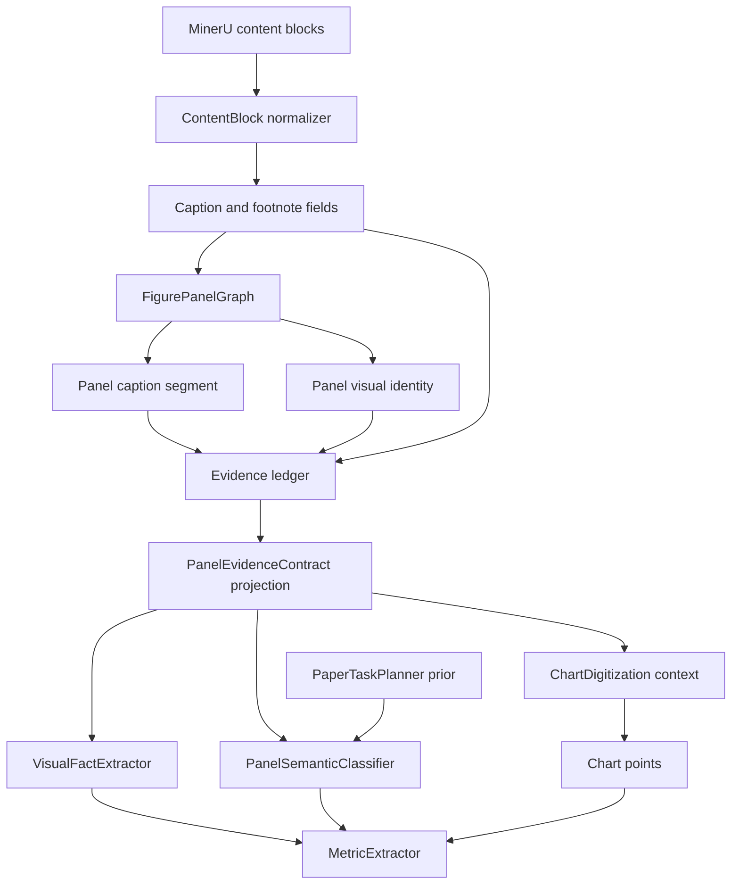

# refactor: Panel-specific evidence contract

## Goal Capsule

| Field | Value |
|---|---|
| Objective | Refactor the Content Pipeline so every panel-level LLM task receives a single, panel-specific evidence contract instead of accumulated raw caption/context fields. |
| Authority | User request, then existing content pipeline architecture, then current tests. |
| Execution profile | Standard refactor touching graph construction, evidence packet construction, LLM input projection, and target-gating semantics. |
| Stop conditions | Do not proceed if the implementation would mix old additive prompt fields with the new contract, or if chart-only digitization starts depending on PaperTask/PanelTask metric gates. |
| Tail ownership | The implementation must leave contract tests that make duplicate caption injection, footnote pollution, and background evidence citation visible. |

---

## Product Contract

### Summary

The content pipeline must give panel-level LLM phases a stable, low-redundancy contract that answers: which panel is current, which image belongs to it, which caption segment belongs to it, which evidence is primary, which evidence is supporting, which evidence is background only, what extraction task the LLM should execute, and what structure the LLM should return.

The fix is not to add more raw source fields to prompts. The fix is to preserve raw structured source data as provenance, normalize it into a canonical evidence ledger, and expose only phase-specific projections to each LLM task.

### Problem Frame

The current pipeline carries MinerU caption and context through several representations without a single authority for panel-local evidence. `caption_fields`, `caption_structured`, `caption_rich_text`, `block.text`, `caption_text`, `_panel_caption_focus()`, and `evidence_map.text_excerpt` can describe the same source in different forms. That creates prompt pollution: duplicated caption text, footnotes mixed with captions, panel-specific text mixed with full figure text, and background context that can be over-weighted by the LLM.

Task planning also has an overly hard gate. `PaperTaskPlanner` is useful as a paper-level prior, but the panel-local classifier should be the phase that makes the final target match against current-panel evidence. A paper-level miss should not silently suppress a panel that has strong local evidence; it should create a reviewable gap candidate.

### Requirements

- R1. Panel-level LLM inputs must identify the current panel with `paper_id`, `figure_id`, `panel_id`, `panel_label`, visual block id, and image reference.
- R2. Panel-level LLM inputs must expose exactly one authoritative current-panel caption segment when available, with provenance and status.
- R3. Figure-level caption text and footnotes must not be merged into the panel caption segment.
- R4. Evidence must be classified as `primary`, `supporting`, `background`, or `non_current_panel`, and metric extraction must only cite evidence allowed for the current panel.
- R5. Raw structured source data must remain available for provenance and debugging, but must not be blindly duplicated into PanelTask prompts.
- R6. `_panel_caption_focus()` may remain only as a legacy fallback, and it must not be exposed alongside an exact or grouped caption segment for the same panel.
- R7. PaperTaskPlanner must act as a paper-level prior, not as the final hard rejection mechanism for panel-local target evidence.
- R8. Chart-only and numeric chart digitization must stay independent of PaperTask/PanelTask metric gates while benefiting from cleaner caption and evidence context.
- R9. The implementation must be backward-compatible enough that existing pipeline phases still run while tests migrate to the new contract.
- R10. Non-chart panel visual extraction must return a typed `VisualFactExtractionResult`; it must not bury panel facts in free-form observations.
- R11. `visual_fact_candidates` must be a first-class output array with slot-based fields and evidence ids.
- R12. Grouped caption segments must be explicitly marked as grouped or lower-confidence; they must not masquerade as exact single-panel captions.

### Acceptance Examples

- AE1. Given a multi-panel figure with caption text `(A) before treatment. (B) after treatment.`, when building inputs for panel A, then `caption_segment.text` contains only the A segment and panel B text is not duplicated in primary evidence.
- AE2. Given a MinerU image block with `image_caption` and `image_footnote`, when building the panel contract, then the footnote is absent from `caption_segment.text` and appears as supporting or background evidence with `text_level=footnote`.
- AE3. Given an exact panel segment, when `_packet_inputs()` or its replacement projects inputs, then `panel_caption_focus` is omitted rather than sent as a second caption source.
- AE4. Given background section text containing numeric values, when MetricExtractor receives the panel contract, then background evidence ids cannot be cited as support for metrics.
- AE5. Given a panel whose visual/chart labels strongly match an ontology target absent from the paper plan, when panel classification runs, then the panel can produce a review-required `paper_task_gap_candidate` rather than being silently rejected.
- AE6. Given `chart_only=True`, when chart digitization runs, then chart points are extracted without `paper_task_plan`, `allowed_metrics`, `matched_target_group_ids`, or ontology metric gates in the digitization prompt.
- AE7. Given a non-chart microscopy, schematic, or photo panel, when visual fact extraction runs, then outputs appear under `visual_fact_candidates` with populated slots, confidence, and evidence ids, not as unstructured `observations`.
- AE8. Given a grouped caption marker such as `(A-D) Shared process.`, when projecting panel A, then the caption segment status is grouped or confidence-degraded and downstream outputs inherit that uncertainty.
- AE9. Given an exact caption segment for a panel, when building the prompt projection, then `caption.caption_segment` is present and legacy `panel_caption_focus` is absent.

### Scope Boundaries

In scope:

- Split caption and footnote semantics at normalization/projection boundaries.
- Add panel caption segmentation with explicit exact/grouped/missing/fallback status.
- Add a canonical evidence ledger and phase-specific PanelEvidenceContract projection.
- Add a typed non-chart `VisualFactExtractionResult` and first-class `visual_fact_candidates`.
- Adjust PaperTaskPlanner and PanelTask responsibilities so paper-level target groups are priors, not the sole permission source.
- Keep chart-only digitization benchmark-free while using cleaner evidence text.

Deferred to Follow-Up Work:

- `page_grid` reconstruction from panel bounding boxes.
- Full `layout_annotations` projection into every LLM phase.
- Image metadata and asset quality in all prompts. Existing chart quality gates already assess visual asset quality before digitization; this plan does not move that entire concern into PanelTask.
- Large ontology redesign beyond the minimal paper-prior versus panel-local match boundary.

Outside this product's identity:

- Do not let LLMs decide evidence policy from raw prompt text.
- Do not turn chart digitization into benchmark metric extraction.
- Do not preserve prompt compatibility by continuing to send every old caption/context representation.

---

## Planning Contract

### Key Technical Decisions

- KTD1. Use one canonical evidence ledger, then phase-specific projections. Raw MinerU structures stay on `ContentBlock.raw_block`, `structured_content`, and provenance fields; PanelTask receives only the projection needed for its phase.
- KTD2. Make `caption_segment` authoritative. If graph construction finds an exact or grouped segment, the prompt must not also send `_panel_caption_focus()` output for the same panel.
- KTD3. Separate `use_policy` from `evidence_role`. `use_policy` controls whether a phase may cite the evidence; `evidence_role` explains why the evidence is primary, supporting, background, or non-current for this panel.
- KTD4. Treat PaperTaskPlanner as a prior. Paper-level target groups narrow likely domains, but panel-local evidence may create a gap candidate that reaches review instead of disappearing.
- KTD5. Keep chart digitization benchmark-free. Chart digitization reads visible chart data; semantic mapping and metric publication happen after digitization.

### High-Level Technical Design



The source graph owns deterministic identity and evidence organization. LLM phases receive projections from `PanelEvidenceContract`, not the raw source bundle.

### PanelEvidenceContract Shape

Directional structure:

```json
{
  "contract_version": "panel_evidence_contract/v1",
  "current_panel": {
    "paper_id": "",
    "figure_id": "",
    "panel_id": "",
    "panel_label": "",
    "visual_block_id": "",
    "image_ref": ""
  },
  "caption": {
    "caption_segment": {
      "text": "",
      "status": "exact|grouped_shared|missing|fallback_regex",
      "confidence": 0.0,
      "grouped_panel_labels": [],
      "provenance": {}
    },
    "figure_caption_summary": "",
    "figure_footnotes": []
  },
  "evidence": {
    "primary": [],
    "supporting": [],
    "background": [],
    "non_current_panel": []
  },
  "extraction_task": {
    "decision": "",
    "matched_target_group_ids": [],
    "allowed_metrics": [],
    "needs_digitization": false,
    "paper_task_gap_candidate": false
  }
}
```

This is a prompt projection contract, not a new persistence schema. The implementation can model it as dataclasses or dictionaries as long as all LLM inputs pass through this shape.

### Prompt Projection Rules

- The prompt projection must have one textual authority for the current panel caption: `caption.caption_segment.text`.
- `caption_structured`, `caption_rich_text`, raw `caption_fields`, and `block.text` must not appear as parallel top-level prompt fields when an exact segment exists.
- `panel_caption_focus` is mutually exclusive with an exact or grouped `caption.caption_segment`. It may appear only when `caption.caption_segment.status=fallback_regex`, and the field name must make the legacy fallback explicit.
- Structured caption tokens may appear only as compact formatted tokens attached to the caption segment when they change scientific meaning, such as inline formula or subscript content.
- `figure_caption_summary` must not repeat the exact segment text. If exact segmentation exists, it should summarize only the non-panel-specific figure frame or be empty.
- Footnotes must be separate evidence items. They may clarify units or uncertainty, but they must not become part of the primary caption segment.
- Grouped caption segments must carry `status=grouped_shared`, `grouped_panel_labels`, and lower confidence than an exact single-panel segment unless another current-panel source independently confirms the assignment.
- Evidence arrays must deduplicate by source block id plus text hash plus segment span. If a caption segment is already printed as the segment text, the evidence item should cite the same text by id/provenance instead of printing a second full copy.
- Each LLM phase gets a projection tailored to its responsibility. Panel classification, non-chart visual fact extraction, metric extraction, and chart digitization must not share a giant all-fields input bundle.

### LLM Output Contracts

Panel classification should continue to produce the fields needed by `PanelSemanticResult`, but the semantic payload should include the contract-derived task decision in a stable object:

```json
{
  "panel_task": {
    "panel_id": "",
    "extraction_decision": "extract_target_metrics|extract_supporting_observation|skip_metric_extraction",
    "evidence_role": "primary_metric_panel|supporting_observation|schematic_context|methods_context|unusable",
    "matched_target_group_ids": [],
    "allowed_metrics": [],
    "allowed_units": [],
    "needs_digitization": false,
    "paper_task_gap_candidate": false,
    "reason": ""
  },
  "evidence_usage": {
    "primary_evidence_ids": [],
    "supporting_evidence_ids": [],
    "background_evidence_ids": []
  },
  "confidence": 0.0
}
```

Non-chart visual extraction must return typed facts through `VisualFactExtractionResult`. The result is for panels whose primary content is microscopy, photos, diagrams, schematics, gels, or other non-chart visuals. It must not publish metric rows directly.

```json
{
  "contract_version": "visual_fact_extraction_result/v1",
  "panel_id": "",
  "visual_fact_candidates": [
    {
      "fact_id": "",
      "fact_type": "morphology|localization|qualitative_change|condition_assignment|schematic_relationship|presence_absence|other_visual_fact",
      "subject_slot": "",
      "attribute_slot": "",
      "value_slot": "",
      "comparator_slot": "",
      "condition_slot": "",
      "location_slot": "",
      "evidence_ids": [],
      "visual_grounding": {
        "image_ref": "",
        "region": null
      },
      "caption_segment_status": "exact|grouped_shared|missing|fallback_regex",
      "support_level": "visual_only|caption_grounded|visual_and_caption_grounded",
      "confidence": 0.0
    }
  ],
  "unsupported_claims": [],
  "confidence": 0.0
}
```

`visual_fact_candidates` is a first-class output, not an alias for `observations`. Free-form observations may remain only as legacy adapter input during migration, and adapters must either convert them into slot-based candidates with evidence ids or reject them as unsupported.

Metric extraction should keep the existing `metrics`, `observations`, `unsupported_claims`, and `confidence` envelope, but every metric must cite only primary or supporting evidence ids. Background evidence can explain context in `unsupported_claims`, but it cannot support a published metric row.

Chart digitization should keep its chart-point output contract and remain benchmark-free. It may cite evidence ids for caption/table context, but it must not output benchmark metrics or use `allowed_metrics` to retain or discard points.

### Assumptions

- No new runtime dependency is required. Use standard library data structures and existing tests.
- All commands remain under `uv run`; dependency changes, if any become necessary, must be managed through `uv sync`.
- The existing `EvidencePacket` can evolve in place; a wholesale replacement is not required for the first implementation pass.
- Existing chart quality gates stay in `content_pipeline/visual/quality_gate.py` and orchestration logic unless a later follow-up plan moves image metadata earlier.

---

## Implementation Units

### U1. Normalize caption, footnote, and text provenance

- **Goal:** Preserve caption body and footnote text as distinct normalized sources before figure graph construction.
- **Requirements:** R2, R3, R5, AE2.
- **Dependencies:** None.
- **Files:** `content_pipeline/contracts/blocks.py`, `content_pipeline/mineru/content_block_normalizer.py`, `tests/test_content_pipeline_context.py`, `tests/test_panel_evidence_contract.py`.
- **Approach:** Add explicit caption-body and footnote buckets while keeping `caption_fields` for compatibility during migration. Ensure `_caption_rich_text()` renders caption body tokens separately from footnote tokens. Do not use all `caption_fields.values()` as a downstream caption source.
- **Patterns to follow:** `ContentBlockNormalizer.normalize_block()` already stores raw MinerU metadata and caption structured content without flattening all raw fields.
- **Test scenarios:**
  - Input image block has `image_caption` and `image_footnote`; normalized block exposes caption text separately from footnote text.
  - Input chart block has `chart_caption` and `chart_footnote`; downstream caption text excludes the footnote.
  - Existing structured caption token rendering for inline equation content still reaches prompt-compatible provenance.
- **Verification:** Normalized blocks retain raw source provenance, and tests prove footnotes are not part of the canonical caption body.

### U2. Build exact and grouped panel caption segments in the figure graph

- **Goal:** Make `PanelNode` carry panel-specific caption segment text, grouping status, confidence, and provenance when markers support it.
- **Requirements:** R1, R2, R3, R6, R12, AE1, AE3, AE8.
- **Dependencies:** U1.
- **Files:** `content_pipeline/contracts/blocks.py`, `content_pipeline/contracts/graph.py`, `content_pipeline/mineru/panel_marker_detector.py`, `content_pipeline/graph/figure_panel_graph.py`, `tests/test_content_pipeline_context.py`, `tests/test_panel_evidence_contract.py`.
- **Approach:** Extend marker handling to support a set of labels per caption marker group. Segment caption body text by sorted marker spans, assign the same segment to labels in marker groups such as `A and B` or `A-D`, and record `grouped_shared` plus lower confidence for grouped assignments. Record `missing` when no segment exists. Keep regex fallback out of graph construction; graph construction either finds exact/grouped segments or marks them missing.
- **Patterns to follow:** `PanelMarkerCandidate` already carries `start`, `end`, confidence, evidence type, and surrounding text. Reuse that provenance rather than rebuilding marker detection in LLM input code.
- **Test scenarios:**
  - Caption `(A) Alpha. (B) Beta.` produces different exact segments for panels A and B.
  - Caption `(A-D) Shared process. (E) Control.` assigns the shared segment to A through D with `status=grouped_shared`, `grouped_panel_labels=["A","B","C","D"]`, and lower confidence than E's exact segment.
  - A panel with no marker has `caption.caption_segment.status=missing`, not a fabricated full-caption segment.
- **Verification:** `PanelNode` can answer current panel label, visual id, caption segment status, grouped labels, confidence, and segment provenance without calling `_panel_caption_focus()`.

### U3. Extend EvidenceItem for the canonical evidence ledger

- **Goal:** Make every evidence item carry enough typed metadata to support current-panel projection, citation rules, and visual fact grounding.
- **Requirements:** R1, R4, R5, R10, R11, AE4, AE7.
- **Dependencies:** U1, U2.
- **Files:** `content_pipeline/contracts/evidence.py`, `content_pipeline/evidence/context_selector.py`, `content_pipeline/evidence/evidence_packet.py`, `tests/test_panel_evidence_contract.py`, `tests/test_content_pipeline_context.py`.
- **Approach:** Extend `EvidenceItem` with safe-default fields: `text_level`, `text_format`, `evidence_role`, `segment_status`, `segment_confidence`, and optional visual grounding metadata. Keep positional constructor compatibility where practical by adding defaults after existing fields, or update fixtures in one explicit pass. Populate these fields at evidence packet construction time without changing LLM prompt surfaces yet.
- **Patterns to follow:** Existing `use_policy` constants in `content_pipeline/contracts/evidence.py` and existing `_extractable_evidence_map()` / `_disambiguation_evidence_map()` separation in `content_pipeline/llm/semantic_phases.py`.
- **Test scenarios:**
  - Existing positional `EvidenceItem` fixtures still construct valid items with conservative defaults.
  - Caption body, footnote, table, formula, visual, background, and sibling items expose distinct `text_level` and `evidence_role` values.
  - Grouped caption evidence carries `segment_status=grouped_shared` and lower confidence than exact caption evidence.
  - Evidence ids remain stable after adding metadata fields.
- **Verification:** Evidence packets contain typed metadata needed for projection, and no prompt has changed before the projection unit consumes it.

### U4. Add the PanelEvidenceContract projection

- **Goal:** Replace additive prompt input assembly with a canonical current-panel evidence projection.
- **Requirements:** R1, R4, R5, R6, R12, AE3, AE4, AE8, AE9.
- **Dependencies:** U3.
- **Files:** `content_pipeline/contracts/evidence.py`, `content_pipeline/evidence/evidence_packet.py`, `content_pipeline/llm/semantic_phases.py`, `content_pipeline/visual/context_builder.py`, `content_pipeline/llm/client.py`, `tests/test_panel_evidence_contract.py`, `tests/test_content_pipeline_visual_quality_and_merge.py`.
- **Approach:** Build a projection helper that emits `PanelEvidenceContract` with `primary`, `supporting`, `background`, and `non_current_panel` arrays. Keep `EvidencePacket` fields for compatibility but make phase input builders consume the contract projection. Enforce mutual exclusivity: exact or grouped `caption.caption_segment` suppresses legacy `panel_caption_focus`; only `fallback_regex` may expose an explicitly named legacy fallback field.
- **Patterns to follow:** Existing `_extractable_evidence_map()` / `_disambiguation_evidence_map()` separation in `content_pipeline/llm/semantic_phases.py`.
- **Test scenarios:**
  - Same caption text hash appears only once in the PanelTask projection.
  - Primary evidence contains the current visual and exact caption segment when available.
  - Footnote evidence is supporting or background, never primary caption segment text.
  - Background evidence remains visible for context but absent from extractable evidence ids.
  - Exact or grouped caption segment inputs omit `panel_caption_focus` and any other legacy duplicate caption field.
  - `fallback_regex` inputs include only an explicitly legacy fallback caption field, not both fallback and exact segment fields.
- **Verification:** `_packet_inputs()` or its replacement returns contract-shaped inputs, and old caption fields are not simultaneously exposed as duplicated prompt text.

### U5. Migrate panel classification prompts to consume the contract

- **Goal:** Make PanelSemanticClassifier reason from contract roles instead of loose caption/context strings.
- **Requirements:** R1, R4, R5, R6, R7, R12, AE3, AE5, AE8, AE9.
- **Dependencies:** U4.
- **Files:** `content_pipeline/llm/semantic_phases.py`, `content_pipeline/llm/phase_schemas.py`, `content_pipeline/adapters/semantic_adapters.py`, `content_pipeline/routing/panel_target_matcher.py`, `tests/test_content_pipeline_strict_llm_architecture.py`, `tests/test_target_guided_extraction.py`.
- **Approach:** Update classifier prompts to name `panel_evidence_contract` as the source of truth. Replace focus-text scoring in `panel_target_matcher.py` with contract caption segment and primary/supporting evidence text. Classifier confidence must reflect grouped caption status instead of treating grouped segments as exact single-panel support.
- **Patterns to follow:** Current prompt contracts already emphasize evidence ids and metric scope. Preserve those constraints while replacing the input surface.
- **Test scenarios:**
  - Exact segment input causes classifier prompt to omit legacy `panel_caption_focus`.
  - Grouped caption segment input remains usable but lowers or flags classification confidence.
  - Panel target matching uses caption segment text before full figure caption text.
  - Classifier output includes contract-derived panel task decision and evidence usage ids.
- **Verification:** Classifier LLM call inputs show one contract source and no parallel raw caption/rich/focus duplication for exact or grouped segments.

### U6. Migrate non-chart visual fact and metric extraction outputs

- **Goal:** Make non-chart extraction produce slot-based `visual_fact_candidates`, and make MetricExtractor consume contract-grounded candidates and evidence ids.
- **Requirements:** R1, R4, R5, R6, R10, R11, AE4, AE7.
- **Dependencies:** U4, U5.
- **Files:** `content_pipeline/llm/semantic_phases.py`, `content_pipeline/llm/phase_schemas.py`, `content_pipeline/adapters/semantic_adapters.py`, `content_pipeline/metrics/metric_scope.py`, `tests/test_content_pipeline_strict_llm_architecture.py`, `tests/test_target_guided_extraction.py`, `tests/test_metric_scope.py`, `tests/test_panel_evidence_contract.py`.
- **Approach:** Add the `VisualFactExtractionResult` schema for non-chart panels. Replace free-form observation production with `visual_fact_candidates` containing slots, support level, caption segment status, visual grounding, confidence, and evidence ids. MetricExtractor must cite only primary/supporting evidence ids and may consume visual fact candidates as candidates, not as publishable metrics without scope verification.
- **Patterns to follow:** Existing prompt contracts already emphasize evidence ids and metric scope. Preserve those constraints while replacing free-form visual observations.
- **Test scenarios:**
  - Non-chart visual extraction output has `visual_fact_candidates` with slot fields and evidence ids.
  - Free-form `observations` alone are rejected or converted into slot-based candidates before downstream use.
  - Visual fact candidates from grouped caption segments carry grouped status or reduced confidence.
  - Metric extractor drops or refuses metrics that cite background-only evidence ids.
  - Existing metric name filtering still drops metrics not in panel allowed metrics.
- **Verification:** Non-chart outputs are slot-based and evidence-grounded; metric extraction cannot publish a metric without allowed evidence ids and scope verification.

### U7. Soften PaperTaskPlanner into a prior and preserve reviewable gaps

- **Goal:** Prevent paper-level target misses from becoming irreversible panel-level suppression.
- **Requirements:** R7, AE5.
- **Dependencies:** U5.
- **Files:** `content_pipeline/llm/semantic_phases.py`, `content_pipeline/llm/phase_schemas.py`, `content_pipeline/llm/ontology_runtime.py`, `content_pipeline/adapters/semantic_adapters.py`, `content_pipeline/metrics/metric_verifier.py`, `content_pipeline/orchestration/pipeline_runner.py`, `tests/test_benchmark_ontology_v1.py`, `tests/test_content_pipeline_strict_llm_architecture.py`, `tests/test_target_guided_extraction.py`.
- **Approach:** Change planner language from final hard constraint to paper-level candidate prior. Keep canonical ontology alignment, but allow panel classification to mark a strong local target as `paper_task_gap_candidate` when it maps to a canonical ontology group outside the paper plan. Downstream publication should remain gated by verifier/review status rather than silent early rejection.
- **Patterns to follow:** Existing planner fallback in `content_pipeline/llm/ontology_runtime.py` and rejected/review-required row handling in orchestration and projection.
- **Test scenarios:**
  - Planner failure still uses stable ontology selector and does not disable later LLM phases.
  - Panel local evidence can produce a gap candidate when the paper plan lacks the group.
  - Gap candidate metrics are not published as clean rows without verifier/review status.
  - Empty or low-confidence paper plan lowers confidence but does not force all panel metrics to disappear.
- **Verification:** Audit trace differentiates planner prior, panel-local gap candidate, verifier accepted/rejected, and review-required outcomes.

### U8. Preserve chart-only and numeric chart independence

- **Goal:** Let chart digitization benefit from cleaner evidence text without depending on benchmark semantics.
- **Requirements:** R8, AE6.
- **Dependencies:** U4.
- **Files:** `content_pipeline/visual/context_builder.py`, `content_pipeline/llm/chart_digitization_phase.py`, `content_pipeline/orchestration/pipeline_runner.py`, `tests/test_content_pipeline_visual_quality_and_merge.py`, `tests/test_content_pipeline_e2e.py`.
- **Approach:** Build visual extraction context from the contract projection but keep `include_benchmark_semantics=False` behavior strict for chart digitization. Chart digitization may receive caption segment, footnotes as context, tables, formulas, and evidence ids, but not `paper_task_plan`, `target_metric_hints`, `allowed_metrics`, or matched target group ids.
- **Patterns to follow:** Existing `CHART_DIGITIZATION_PROMPT` already says not to use benchmark metric constraints, and tests already assert forbidden fields are excluded.
- **Test scenarios:**
  - `chart_only=True` still skips PaperTaskPlanner, PanelSemanticClassifier, MetricExtractor, and benchmark metric phases.
  - Chart digitization inputs contain cleaned caption segment and evidence_map.
  - Chart digitization inputs do not contain target metric hints or allowed metrics.
  - Numeric chart without target match still exports chart facts.
- **Verification:** Existing chart-only tests remain green and new tests prove contract fields do not reintroduce benchmark gates.

---

## System-Wide Impact

This refactor changes the authority boundary for LLM inputs. Graph and evidence code become responsible for panel-local evidence role assignment; LLM phases become consumers of a constrained contract. Audit outputs should expose enough of the contract to debug panel failures without requiring raw MinerU source inspection.

The change also affects prompt size. The intended result is less prompt text, not more. If a patch increases prompt size by sending both old and new fields, it violates the plan.

---

## Risks & Dependencies

| Risk | Mitigation |
|---|---|
| Duplicate caption text survives through compatibility fields. | Add projection tests that fail when exact or grouped segments coexist with legacy focus text or repeated caption excerpts. |
| Marker grouping creates false exact segments. | Store `grouped_shared` status and method; prefer `missing` over pretending exactness when marker confidence is insufficient. |
| Non-chart visual facts regress into prose observations. | Add schema and adapter tests requiring `visual_fact_candidates` slots and evidence ids before downstream use. |
| PaperTask softening allows noisy metrics through. | Route paper-plan gaps to review-required/verifier paths, not publishable rows. |
| Chart-only receives benchmark semantics through shared context builder. | Keep tests that inspect chart digitization call inputs for forbidden fields. |
| Existing tests construct `EvidenceItem` positionally. | Add new fields with safe defaults or update fixtures in a controlled compatibility pass. |

---

## Sources & Research

- `docs/content_pipeline_llm_architecture.md` describes the current source-to-LLM pipeline and phase responsibilities.
- `content_pipeline/mineru/content_block_normalizer.py` currently extracts caption and footnote keys into one `caption_fields` map.
- `content_pipeline/graph/figure_panel_graph.py` currently assigns shared full figure captions to panels and builds panel ids.
- `content_pipeline/evidence/context_selector.py` currently selects local text with a narrow reading-order window and coarse policy buckets.
- `content_pipeline/evidence/evidence_packet.py` currently builds `EvidencePacket` from selected context and use policies.
- `content_pipeline/llm/semantic_phases.py` currently builds `_packet_inputs()`, computes `_panel_caption_focus()`, and applies PaperTask/PanelTask gating.
- `content_pipeline/visual/context_builder.py` and `content_pipeline/llm/chart_digitization_phase.py` define the chart-only input boundary that must remain benchmark-free.

---

## Verification Contract

| Gate | Applies to | Command |
|---|---|---|
| Context and evidence regression tests | U1-U4 | `uv run pytest tests/test_content_pipeline_context.py tests/test_panel_evidence_contract.py -q` |
| Strict LLM architecture tests | U5-U7 | `uv run pytest tests/test_content_pipeline_strict_llm_architecture.py tests/test_target_guided_extraction.py tests/test_metric_scope.py -q` |
| Non-chart visual fact contract tests | U6 | `uv run pytest tests/test_panel_evidence_contract.py tests/test_target_guided_extraction.py -q` |
| Chart-only and visual context tests | U4, U8 | `uv run pytest tests/test_content_pipeline_visual_quality_and_merge.py::test_chart_digitization_inputs_exclude_benchmark_metric_semantics tests/test_content_pipeline_visual_quality_and_merge.py::test_numeric_chart_digitization_skips_metric_target_gate tests/test_content_pipeline_e2e.py::test_chart_only_mode_skips_taskplan_and_benchmark_metric_phases -q` |
| Ontology planner alignment tests | U7 | `uv run pytest tests/test_benchmark_ontology_v1.py -q` |
| Full targeted regression sweep | All units | `uv run pytest tests/test_content_pipeline_context.py tests/test_content_pipeline_strict_llm_architecture.py tests/test_content_pipeline_visual_quality_and_merge.py tests/test_target_guided_extraction.py tests/test_benchmark_ontology_v1.py -q` |

No dependency changes are expected. If implementation discovers a new dependency need, update dependency management through `uv sync` and add the dependency change to the plan before implementation continues.

---

## Definition of Done

- R1-R12 are covered by tests or explicit audit assertions.
- `PanelNode` or the contract projection can identify current panel, current visual, exact/grouped/missing caption segment, confidence, and provenance.
- Footnotes are never part of `caption_segment.text`.
- Exact or grouped caption segments and legacy regex focus are mutually exclusive in LLM inputs.
- Grouped caption segments carry grouped status or lower confidence through projection and extraction outputs.
- Non-chart panel outputs use `VisualFactExtractionResult.visual_fact_candidates` with slots, evidence ids, support level, and confidence.
- Free-form visual observations are not accepted as the primary non-chart extraction output.
- `evidence_map` or its replacement includes text level, evidence role, use policy, and longer excerpts without duplicating the same source text.
- Metric extraction cannot cite background-only or non-current-panel evidence.
- PaperTaskPlanner no longer acts as the only hard permission source for panel-local target evidence.
- Chart-only digitization still excludes benchmark semantics and still exports chart facts.
- Audit output is sufficient to explain why a panel extracted metrics, produced review-required gap candidates, or skipped extraction.
- Abandoned compatibility paths or experimental helper code are removed before completion.
