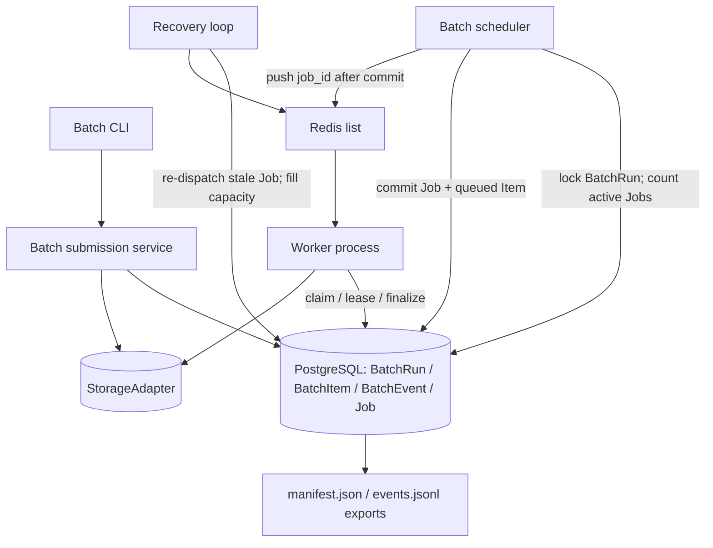
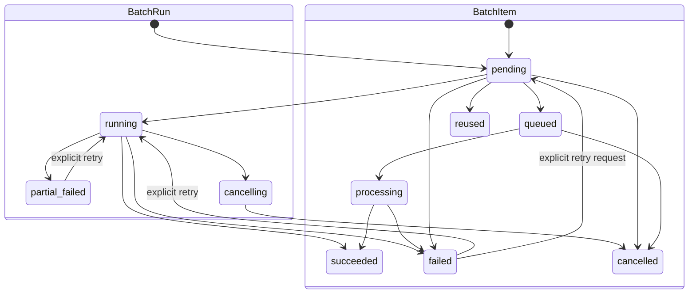

# Batch PDF Processing V1 - Plan

## Goal Capsule

- **Objective:** Add a durable CLI-driven batch workflow that uploads a deterministic set of PDFs, reuses compatible successful results, schedules bounded end-to-end `paper_parse` jobs, exposes recoverable progress, and preserves retry lineage.
- **Authority:** The Product Contract and Key Technical Decisions in this plan override incidental behavior in the current standalone batch scripts. Existing PostgreSQL, object-storage, Redis, Job lease, and immutable ExtractionRun contracts remain authoritative unless this plan explicitly extends them.
- **Execution profile:** Implement additively in the existing FastAPI/worker architecture. Preserve non-batch API jobs by keeping new Job foreign keys nullable.
- **Stop conditions:** Stop rather than infer if implementation requires cross-project reuse, config changes during retry, processing-job preemption, or a replacement for the existing Redis queue contract.
- **Tail ownership:** Completion includes migrations, focused PostgreSQL and CLI tests, architecture documentation, and all repository quality gates.

---

## Product Contract

### Summary

The product gains a first-class batch operation rather than a shell loop around single-file commands. A BatchRun records one deterministic folder submission, BatchItems record its selected PDFs, BatchEvents preserve append-only lifecycle evidence, and existing Jobs and ExtractionRuns remain the execution and result facts.

### Problem Frame

The current upload service creates one `paper_parse` Job per PDF, and that Job already runs MinerU followed by content extraction. The missing layer is durable orchestration across many PDFs: bounded Job creation, batch-to-Job lineage, progress after CLI exit, compatible result reuse, and recovery when a Redis message or worker disappears.

### Actors

- A1. **Batch operator:** submits a folder, observes progress, cancels unstarted work, and explicitly retries failures.
- A2. **Batch scheduler:** creates only enough durable Jobs to fill the configured batch window.
- A3. **Worker:** claims one Job, runs parsing and extraction, and commits Job, ExtractionRun, BatchItem, and BatchEvent facts.
- A4. **Recovery loop:** re-dispatches durable Jobs whose Redis notification or processing lease was lost and fills newly available batch capacity.

### Requirements

**Batch identity and audit**

- R1. Each submission creates one durable BatchRun and one deterministically ordered BatchItem per selected PDF.
- R2. BatchRun, BatchItem, and append-only BatchEvent are PostgreSQL facts; `manifest.json` and `events.jsonl` are rebuildable exports.
- R3. BatchEvent records only meaningful batch/item transitions and carries optional Job or ExtractionRun identifiers in its JSON data.

**Execution and concurrency**

- R4. Every batch Job links to exactly one BatchItem through nullable `Job.batch_item_id`; one BatchItem may have multiple historical Jobs.
- R5. For a BatchRun, Jobs in `pending`, `redis_dispatched`, `retry`, or `processing` never exceed `batch_concurrency`.
- R6. Batch concurrency, deployed worker count, per-worker LLM concurrency, and provider-global limiting remain separate controls.
- R7. Redis carries only Job references; PostgreSQL can re-dispatch a durable Job after a lost push, destructive `BLPOP`, or expired worker lease.

**Reuse and retry**

- R8. Within one project, a PDF reuses an existing `succeeded` ExtractionRun only when SHA-256 and `result_config_hash` are compatible and required persisted results remain available.
- R9. Concurrent BatchItems with the same project, SHA-256, and result configuration produce at most one new execution.
- R10. Explicit retry reuses the failed BatchItem but creates a new Job and, after parsing reaches extraction, a new ExtractionRun linked to prior history.
- R11. Transport retry reuses the same Job and does not create explicit retry lineage.
- R12. Historical Jobs and ExtractionRuns are never overwritten or physically removed by batch operations.

**Lifecycle and scope**

- R13. BatchRun uses only `pending`, `running`, `succeeded`, `partial_failed`, `failed`, `cancelling`, and `cancelled`.
- R14. BatchItem uses only `pending`, `queued`, `processing`, `succeeded`, `failed`, `reused`, and `cancelled`; optional `current_stage` provides uploading/parsing/extracting/persisting detail.
- R15. Cancellation stops new Job creation, cancels pending or queued work, and allows already processing Jobs to finish without preemption.
- R16. BatchRun terminal summaries are derived from BatchItem states, with a single explicit retry transition from `failed` or `partial_failed` back to `running`.

### Key Flows

- F1. **Submit and start a batch**
  - **Trigger:** A1 submits a folder with a limit, batch concurrency, and resolved config.
  - **Steps:** Discover and hash PDFs; create BatchRun and BatchItems; upload/register each PDF; resolve compatible reuse; create up to the concurrency window of Jobs; push their IDs after commit.
  - **Outcome:** The batch is terminal if every item was reused/failed during preparation, otherwise it is running with at most `batch_concurrency` nonterminal Jobs.
  - **Covered by:** R1-R9, R13-R14, R16.
- F2. **Execute and recover work**
  - **Trigger:** A3 receives a Job ID or A4 finds a durable stale Job.
  - **Steps:** Claim the Job; move its BatchItem to processing; update `current_stage`; finalize Job, Run, Item, and Event facts; fill released capacity. Lost Redis notifications and expired leases re-dispatch the same Job.
  - **Outcome:** Work progresses without exceeding the batch window or duplicating explicit attempts.
  - **Covered by:** R4-R7, R11-R14, R16.
- F3. **Retry failed items**
  - **Trigger:** A1 explicitly retries selected failed items after a failed or partial-failed batch.
  - **Steps:** Return selected items to pending; move the batch to running; let the scheduler create new Jobs with `retry_of_job_id`; link new runs through `parent_run_id` when a prior run exists.
  - **Outcome:** New attempts are auditable and prior attempts remain unchanged.
  - **Covered by:** R10-R14, R16.

### Acceptance Examples

- AE1. **Lost Redis push**
  - **Given:** A Job and queued BatchItem committed successfully but Redis push failed.
  - **When:** Recovery scans durable pending Jobs.
  - **Then:** It pushes the same Job ID and does not create a replacement Job or free the batch window early.
  - **Covers:** R5, R7.
- AE2. **Concurrent schedulers**
  - **Given:** Two scheduler instances attempt to fill the same BatchRun concurrently.
  - **When:** Both calculate available capacity.
  - **Then:** BatchRun row locking serializes their transactions and the committed nonterminal Job count remains within `batch_concurrency`.
  - **Covers:** R5.
- AE3. **Same PDF in two batches**
  - **Given:** Two BatchItems in the same project share SHA-256 and result config, with no successful result yet.
  - **When:** Their schedulers attempt to create work concurrently.
  - **Then:** The Paper row and active-hash uniqueness serialize the decision; one Job executes while the other item waits and later becomes reused or failed from that outcome.
  - **Covers:** R8-R9.
- AE4. **Explicit retry after MinerU failure**
  - **Given:** A BatchItem has a failed Job but no ExtractionRun.
  - **When:** The operator explicitly retries it.
  - **Then:** A new Job points to the failed Job through `retry_of_job_id`; a new ExtractionRun is created only if the retry reaches extraction.
  - **Covers:** R10-R12.

### Success Criteria

- A batch remains observable and recoverable after the submitting CLI exits.
- Multiple scheduler instances cannot overfill a batch or create duplicate Jobs for one pending item.
- A Redis notification failure or worker crash delays work but does not lose it or inflate explicit retry history.
- Compatible successful results are reused, while semantic configuration changes force new execution.
- The focused batch suite, full backend suite, Ruff, frontend build, and migration checks pass.

### Scope Boundaries

**Included in V1**

- Folder submission, deterministic ordering/limit, durable progress, cancellation without preemption, explicit failed-item retry, same-project result reuse, bounded Job creation, recovery, JSONL/manifest export, and CLI progress/exit codes.
- One machine with one worker process, bounded in-process Job concurrency, and non-realtime recovery after that worker process exits. The live worker protects its own processing lease owners from its periodic stale scan; a replacement process may recover those Jobs only after deployment confirms the prior process has exited.

**Deferred to Follow-Up Work**

- Pause/general resume, priority, fairness, preemption, cross-project reuse, claim-time lease-only batch slots, persistent aggregate projections, versioned BatchEvent envelopes, event immutability triggers, config-changing retry, and streaming/sharded submission.
- Multi-worker or multi-host execution, multi-leader scheduling, realtime lease takeover, heartbeat-driven pipeline interruption, and per-object-write generation fencing.

**Outside this plan**

- The provider-global limiter algorithm. It remains an independent required execution boundary and must not be replaced by batch concurrency.

---

## Planning Contract

### Key Technical Decisions

- KTD1. **Bound concurrency by durable nonterminal Jobs.** Count batch-linked Jobs in `pending`, `redis_dispatched`, `retry`, or `processing`. Queued work reserves capacity, so Redis or worker outages reduce utilization without causing oversubscription.
- KTD2. **Serialize scheduling with the BatchRun row.** Every capacity calculation and Job-creation transaction takes `SELECT FOR UPDATE` on the BatchRun before counting Jobs and locking candidate BatchItems. Candidate Paper rows are locked in ascending Paper ID order to prevent cross-batch deadlocks. No state-version framework is required in V1.
- KTD3. **Keep status ownership separated.** BatchItem.status is the batch lifecycle fact, Job.status is the dispatch/claim attempt fact, ExtractionRun.status is the extraction-result fact, and BatchRun.status is the persisted aggregate snapshot derived from BatchItems.
- KTD4. **Keep event storage minimal.** BatchEvent has batch, optional item, event type, JSON data, and timestamp. Application repositories never update/delete events; database immutability triggers and event schema versioning are deferred.
- KTD5. **Separate upload from enqueue and centralize parse-Job admission.** The reusable PDF-ingestion service validates and registers Paper/StorageObject without automatically creating a Job. Batch and non-batch producers both use one parse-Job admission method that locks Paper and refuses to create a second active `paper_parse` Job for it; only the batch scheduler creates batch-linked Jobs.
- KTD6. **Use config fingerprints only for result semantics.** BatchRun stores one resolved `config_snapshot` and one `result_config_hash`. Batch Jobs construct MinerU, pipeline, and model inputs from that snapshot rather than re-reading worker environment defaults. New batch runs copy the canonical hash into `ExtractionRun.config_snapshot["result_config_hash"]`; historical runs without that key are not reusable in V1. Concurrency, worker capacity, polling, logging, and non-semantic retry settings are excluded from the hash.
- KTD7. **Reuse Paper locking for cross-batch deduplication and parse serialization.** Every `paper_parse` Job producer, including existing upload/retry paths, locks the Paper row and checks every active parse Job before creation. A waiting batch item remains pending until the active attempt reaches a terminal state; a compatible failure propagates failure, while a hash-unknown or incompatible success/failure returns the item to scheduling for its own configuration.
- KTD8. **Treat Job.attempt as diagnostic.** Transport retry keeps the same Job and does not change attempt. Explicit lineage relies on `retry_of_job_id`; correctness and uniqueness never depend on attempt numbering.

### High-Level Technical Design

### Minimal Schema Shape

**BatchRun**

- `id`, `project_id`, `submission_key`, `source_root`, `status`, `batch_concurrency`, `config_snapshot`, `result_config_hash`, `error_message`, `created_at`, `updated_at`, `completed_at`.
- Unique `(project_id, submission_key)`; checks for known status and positive concurrency; index `(project_id, status, updated_at)`.

**BatchItem**

- `id`, `batch_run_id`, `ordinal`, `source_relative_path`, `source_sha256`, `source_size_bytes`, `status`, `current_stage`, `paper_id`, `resolved_extraction_run_id`, `error_message`, `created_at`, `updated_at`.
- Unique `(batch_run_id, ordinal)` and `(batch_run_id, source_relative_path)`; indexes `(batch_run_id, status)`, `source_sha256`, and `paper_id`.

**BatchEvent**

- `id`, `batch_run_id`, nullable `batch_item_id`, `event_type`, `data`, `created_at`.
- Batch and item foreign keys use RESTRICT with no ORM delete cascade. Index `(batch_run_id, id)` and `(batch_item_id, id)`; V1 exposes no physical-delete or UPDATE API for batch facts or events.

**PendingJob additions**

- Nullable `batch_item_id` with RESTRICT foreign key and index.
- Nullable `retry_of_job_id` self-reference with RESTRICT foreign key.
- Existing unique idempotency key remains the Job-creation backstop.

### Transaction and Recovery Rules

1. Directory discovery, ordering, limit application, and hashing occur outside a database transaction.
2. BatchRun and all BatchItem manifest rows commit in one transaction keyed by `submission_key`.
3. Each PDF upload/registration uses a short item transaction; an object-store write may leave an unreferenced object after rollback, handled by existing idempotent object keys and later cleanup.
4. Scheduling locks BatchRun, counts nonterminal batch Jobs, locks pending items, locks their Paper rows in ascending ID order, resolves same-SHA reuse/waiting, creates Jobs, moves items to queued, and appends events in one transaction.
5. Redis push occurs after commit. Push failure leaves the Job `pending` and its BatchItem `queued`; stale dispatch pushes the same Job later. A batch-linked `paper_parse` Job is not cancelled merely because its Paper is already `done`, because an incompatible result configuration may still require execution.
6. Worker claim updates Job and BatchItem to processing in one transaction. Stage changes append events without changing the Item business state.
7. MinerU completion and initial running ExtractionRun creation may remain committed recovery checkpoints. Extraction success/failure helpers must not commit terminal facts internally; the outer worker finalizer owns one terminal transaction for Run, Job, BatchItem, BatchEvent, and derived BatchRun status.
8. Successful finalization commits Run `succeeded`, Job `done`, BatchItem `succeeded` with `resolved_extraction_run_id` set, BatchEvent, and the derived BatchRun status together.
9. Extraction `partial_failure` commits Run `partial_failure`, Job `done`, and BatchItem `failed` with an explanatory error, making the item explicitly retryable but not reusable. Other failures commit the available Run failure, Job failure, Item failure, event, and aggregate state together.
10. Expired processing recovery first excludes Jobs owned by the currently live singleton worker process. After a replacement worker confirms the prior process has exited, it commits an old processing Job as `retry`, clears its lease, returns its BatchItem to queued, and appends an event. It then pushes Redis; successful push conditionally changes the still-dispatchable Job to `redis_dispatched`, while failure leaves it `retry`. The same Job continues to reserve one batch slot.
11. A transport retry that finds an existing running ExtractionRun skips MinerU and resumes extraction from the Run's frozen input object and already persisted parse assets. Only a Job without a Run may restart parsing.
12. Periodic scheduling fills capacity after a terminal Job even if the completing worker crashed before directly invoking the scheduler.
13. Any transaction that changes a batch Job to terminal or cancels it uses lock order BatchRun → Job → BatchItem. The outer finalizer locks BatchRun before Job ownership checks; claim alone may lock Job → BatchItem because it never waits on BatchRun.

### Aggregate Rules

- `pending`: no Job has been queued yet and unresolved items remain.
- `running`: any pending/queued/processing item remains after scheduling begins.
- `succeeded`: every item is succeeded or reused.
- `partial_failed`: at least one item is succeeded/reused and at least one is failed, with no pending/queued/processing items.
- `failed`: no item is succeeded/reused, at least one is failed, and no pending/queued/processing items remain.
- `cancelling`: cancellation was requested; no new Jobs may be created.
- `cancelled`: no queued/processing items remain after pending/queued cancellation; already completed outcomes remain visible in item counts.

Counts are queried live from BatchItem using `(batch_run_id, status)`. Only BatchRun.status is persisted as an aggregate snapshot; per-status counters are not stored in V1.

### Cancellation Rule

Cancellation locks BatchRun, then locks each unclaimed Job and its BatchItem before changing it. Jobs still in `pending`, `redis_dispatched`, or `retry` and their queued Items become cancelled; a Job already locked/claimed as processing is left to finish. Terminal finalization and recovery use the same BatchRun → Job → BatchItem order and expected-status checks, so they cannot deadlock with or overwrite cancellation. Duplicate Redis messages for cancelled Jobs fail claim because their Job state is no longer claimable. Once no processing Job remains, the batch becomes cancelled.

### Migration and Rollout Sequence

1. Add `batch_runs`, `batch_items`, and `batch_events`; add nullable `pending_jobs.batch_item_id` and `pending_jobs.retry_of_job_id`; add checks, foreign keys, and query indexes.
2. Do not backfill historical Jobs because prior batch membership cannot be inferred safely.
3. Deploy readers/workers that tolerate nullable batch fields before enabling batch submission.
4. Keep Redis payload v2 unchanged: `schema_version`, `task_type`, and `job_id` only.
5. Enable the batch CLI and scheduler after PostgreSQL migration and worker rollout.
6. Keep schema forward-only. Before entrypoint enablement, application rollback is safe; afterward, disable batch submission and scheduling and let compatible workers drain or terminate all nonterminal batch Jobs before rolling workers back. Recovery must not dispatch batch-linked Jobs to old workers.

### Risks and Mitigations

| Risk | Mitigation |
|---|---|
| Queued Jobs reserve all slots while Redis is unavailable | Recovery re-dispatches the same durable Jobs; conservative underutilization is accepted in V1. |
| Two schedulers overfill one batch | Lock BatchRun before counting and creating Jobs; perform both operations in one transaction. |
| Two workers parse the same mutable Paper | Route every batch and non-batch parse-Job producer through the same Paper-locked admission method. |
| A waiting same-SHA item never receives the first execution's outcome | Periodic scheduling revisits pending items after terminal Job transitions. |
| BatchItem, Job, and Run states drift | Preserve only nonterminal recovery checkpoints inside pipeline services; the outer worker owns every terminal transaction. |
| Current upload service auto-enqueues | Extract registration into a reusable service and preserve the existing single-upload behavior as a caller-controlled enqueue step. |

---

## Implementation Units

### U1. Add the batch persistence contract

- **Goal:** Add the minimum BatchRun, BatchItem, and BatchEvent models and nullable Job lineage fields through Alembic.
- **Requirements:** R1-R4, R10-R14.
- **Dependencies:** None.
- **Files:** `app/models/batch.py`, `app/models/job.py`, `app/models/__init__.py`, `migrations/versions/0006_batch_processing.py`, `tests/test_production_persistence.py`, `tests/test_batch_processing.py`.
- **Approach:** Use additive tables and nullable Job foreign keys. Keep BatchEvent append-only at the repository/API layer without a database trigger. Do not add state versions, stored counters, manifest-object requirements, or an active-Job partial unique index.
- **Patterns to follow:** UUID persistence entities in `app/models/persistence.py`; migration checks/indexes in `migrations/versions/0005_concurrency_and_immutability_guards.py`; PostgreSQL integration coverage in `tests/test_production_persistence.py`.
- **Test scenarios:**
  - Fresh SQLite and PostgreSQL migrations create all batch tables, foreign keys, checks, and indexes without changing existing Job rows.
  - One BatchItem accepts multiple Jobs while each Job belongs to at most one BatchItem.
  - A Job can reference a prior Job through `retry_of_job_id` without changing either historical row.
  - Invalid BatchRun/BatchItem statuses and non-positive concurrency are rejected.
  - Deleting a BatchRun or BatchItem that has dependent items/events is blocked by RESTRICT; batch services expose no operation that deletes historical Jobs or ExtractionRuns.
- **Verification:** Alembic reaches the new head from a fresh database and from the current head; existing non-batch Job creation remains valid with NULL batch fields.

### U2. Separate PDF registration and implement batch submission/reuse

- **Goal:** Create deterministic BatchItems, register PDFs without immediate enqueue, and resolve compatible successful results.
- **Requirements:** R1-R3, R8-R9, R12-R14; F1; AE3.
- **Dependencies:** U1.
- **Files:** `app/services/pdf/upload_service.py`, `app/services/batches.py`, `app/repositories/batches.py`, `app/services/extraction_runs.py`, `tests/test_batch_processing.py`, `tests/test_paper_upload_and_image_extraction.py`.
- **Approach:** Extract the reusable registration boundary from `PaperUploadService.create_from_upload` while preserving the existing single-upload behavior through a shared Paper-locked parse-Job admission method. Discover and hash files before the batch transaction, store one item per relative path, upload/register each item in a short transaction, and compare successful runs using project, SHA-256, and the fixed result hash stored in Run config. Every batch and non-batch producer waits when any parse Job is active for that Paper; after it terminates, only a compatible outcome may be reused or propagated.
- **Execution note:** Characterize the current single-upload enqueue and duplicate-PDF behavior before extracting registration logic.
- **Patterns to follow:** Existing active-paper hash uniqueness and `ObjectStore` conditional creation; `ExtractionRun` provenance fields and immutable terminal facts.
- **Test scenarios:**
  - Deterministic relative-path ordering and limit selection produce stable ordinals across repeated discovery.
  - Repeating the same submission key returns the existing BatchRun and does not duplicate items.
  - An invalid or oversized PDF fails only its BatchItem and does not roll back other registered items.
  - A same-project, same-SHA, same-result-config successful run marks the new item reused and creates no Job.
  - A succeeded Run with matching SHA/config but missing required normalized results or persisted artifacts is not reused and is scheduled for new execution.
  - A legacy or non-batch Run without `config_snapshot.result_config_hash` is treated as incompatible and is not reused.
  - A semantic config change produces a different result config hash and does not reuse the old run.
  - Two same-SHA items in one or two batches converge on one Paper; while any `paper_parse` Job is active, the other remains pending.
  - A non-batch producer invoked after a batch Job is already queued does not create a second active parse Job for the same Paper.
  - A compatible active execution that succeeds resolves waiting items to reused; a compatible failure resolves them to failed without automatic retry.
  - A hash-unknown or incompatible active execution, whether successful or failed, does not decide the waiting item's outcome; the item later schedules its own Job.
- **Verification:** Existing HTTP upload tests remain green and the batch service can prepare a mixed batch of new, reused, and invalid PDFs without Redis.

### U3. Add bounded batch scheduling and durable dispatch

- **Goal:** Fill each batch with at most `batch_concurrency` nonterminal Jobs and recover lost Redis notifications.
- **Requirements:** R4-R7, R9, R13-R16; F1-F2; AE1-AE3.
- **Dependencies:** U1, U2.
- **Files:** `app/repositories/batches.py`, `app/repositories/jobs.py`, `app/services/pdf/dispatcher.py`, `app/queue/redis_queue.py`, `tests/test_batch_processing.py`, `tests/test_production_persistence.py`.
- **Approach:** Lock BatchRun, count linked Jobs in pending/redis_dispatched/retry/processing, lock eligible pending BatchItems, and create at most the remaining capacity. Commit Job, Item, BatchRun, and BatchEvent before pushing Redis. Refactor stale dispatch into PostgreSQL-first recovery: lock/conditionally update the eligible Job and linked Item, commit retry/queued state, push, then conditionally mark redis_dispatched. Batch-linked parse Jobs use BatchItem/result compatibility rather than the current Paper=`done` cancellation shortcut.
- **Patterns to follow:** `JobRepository.claim` row locking and fencing; `dispatch_stale_pending_jobs` PostgreSQL-first recovery.
- **Test scenarios:**
  - Covers AE2. Two concurrent scheduler sessions cannot create more Jobs than batch concurrency.
  - A batch with concurrency three creates only three Jobs while additional prepared items remain pending.
  - Covers AE1. Redis push failure leaves the same Job pending and item queued; stale dispatch later pushes that Job ID.
  - A batch-linked Job for an already-done Paper with incompatible config remains dispatchable after its first Redis push fails.
  - Duplicate Redis messages do not create another Job or move an already processing item backward.
  - Expired processing recovery reuses the original Job, moves the item to queued, and keeps the in-flight count unchanged.
  - A worker that consumes immediately after recovery cannot observe the old processing state because retry/queued commit precedes Redis push.
  - Concurrent cancellation and stale recovery cannot change a cancelled Job back to retry or redis_dispatched.
  - A terminal Job frees one slot and the next scheduling pass creates exactly one replacement Job.
  - Scheduler execution against a cancelling or terminal batch creates no work.
- **Verification:** PostgreSQL concurrency tests prove the invariant under independent sessions; queue recovery tests prove redis loss changes latency rather than correctness.

### U4. Integrate worker lifecycle, cancellation, and explicit retry

- **Goal:** Make worker transitions update batch facts atomically and preserve explicit retry lineage.
- **Requirements:** R3-R7, R10-R16; F2-F3; AE4.
- **Dependencies:** U1, U3.
- **Files:** `app/worker.py`, `app/repositories/jobs.py`, `app/repositories/batches.py`, `app/services/pdf/parse_service.py`, `app/services/pdf/pipeline.py`, `app/services/extraction_runs.py`, `tests/test_batch_processing.py`, `tests/test_production_persistence.py`.
- **Approach:** Extend claim to move linked items queued to processing/parsing. Resolve every batch execution input from BatchRun.config_snapshot and copy its result hash into the Run config. Preserve MinerU and running-Run checkpoints, but move all terminal commits out of nested pipeline failure/success helpers into the outer worker finalizer so Run, Job, Item, Event, and aggregate status commit together. A transport retry with an existing running Run skips MinerU and resumes from its frozen input and parse assets. Explicit retry moves selected failed items to pending, links the next Job through `retry_of_job_id`, and supplies the prior run as `parent_run_id` when present. Terminal finalization and cancellation both lock BatchRun → Job → BatchItem; cancellation stops scheduling and cancels unclaimed work without preempting processing Jobs.
- **Patterns to follow:** Existing Job ownership/fencing checks, ExtractionRun terminal guards, and `create_extraction_run` one-run-per-Job behavior.
- **Test scenarios:**
  - Claiming a batch Job changes Job to processing and Item to processing/parsing in one transaction.
  - MinerU failure marks Job and Item failed without requiring an ExtractionRun.
  - Successful extraction commits Run succeeded, Job done, Item status succeeded with `resolved_extraction_run_id` set, event, and aggregate batch state together.
  - A partial-failure Run commits Job done but BatchItem failed, remains non-reusable, and is eligible for explicit retry.
  - Extraction failure preserves raw responses, marks all applicable facts failed, and releases scheduling capacity.
  - Covers AE4. Explicit retry after a pre-run failure creates a new Job with no fabricated parent run.
  - Explicit retry after a failed run creates a new Job and new Run linked to the immediate historical Job/Run; old rows remain unchanged.
  - Transport retry after lease expiry reuses the same Job and existing running Run and does not add explicit retry history.
  - A crash immediately after running Run creation resumes extraction without rerunning MinerU or replacing the Run's frozen input provenance.
  - Terminal pipeline failure cannot commit Run/Job before the linked BatchItem/Event/BatchRun terminal transaction.
  - Cancelling a batch cancels pending/queued work, prevents new Jobs, permits processing Jobs to finish, and eventually yields cancelled.
  - Worker claim and cancellation in independent PostgreSQL sessions cannot produce Job processing with Item cancelled or overwrite a claimed Job.
  - Processing completion and batch cancellation in independent PostgreSQL sessions follow one lock order, avoid deadlock, and preserve cancelling/cancelled aggregate semantics.
  - Failed/partial-failed retry is the only terminal-to-running transition; succeeded and cancelled batches cannot reopen.
- **Verification:** Focused integration tests cover success, failure-before-run, failure-after-run, lost lease, cancellation, and explicit retry with immutable history.

### U5. Add the batch CLI, progress exports, and operational documentation

- **Goal:** Expose submission, status/follow, failed-item retry, cancellation, and deterministic audit exports through the existing CLI.
- **Requirements:** R1-R3, R8, R10, R13-R16; F1-F3.
- **Dependencies:** U2-U4.
- **Files:** `scripts/cli.py`, `tests/test_content_pipeline_cli.py`, `tests/test_batch_processing.py`, `README.md`, `ARCHITECTURE.md`, `docs/adr/0011-batch-processing-orchestration.md`.
- **Approach:** Keep `scripts/cli.py` thin: validate arguments, call batch services, poll PostgreSQL, render Rich progress, support machine-readable output, and map terminal outcomes to exit codes. Export `manifest.json` from BatchItem rows and `events.jsonl` from BatchEvents ordered by creation time and ID. Document batch concurrency separately from worker and provider limits.
- **Patterns to follow:** Existing Typer/Rich output in `scripts/cli.py`, current CLI tests with `CliRunner`, and architecture/ADR conventions in `docs/adr/`.
- **Test scenarios:**
  - Submitting a folder passes deterministic file selection, concurrency, and config to the service without executing pipeline logic inside the CLI module.
  - Status/follow displays total pending/queued/processing/succeeded/failed/reused/cancelled counts from PostgreSQL.
  - All-success/reused returns exit code 0, any terminal failure returns 1, invalid input returns 2, and interrupted follow returns 130 without cancelling work.
  - Explicit retry targets only failed items and reports the new Job IDs when scheduled.
  - `manifest.json` exactly represents BatchItem order, hashes, paths, and resolved IDs.
  - `events.jsonl` is reproducible from BatchEvent rows and is never treated as a separate write source.
  - CLI exit followed by a status invocation observes the same durable batch and ongoing worker progress.
- **Verification:** CLI help and focused tests pass; README, architecture map, and ADR describe the implemented flow and its V1 boundaries without claiming pause, fairness, or preemption.

---

## Verification Contract

| Gate | Command | Required outcome |
|---|---|---|
| Dependency consistency | `uv sync` | Environment and lockfile resolve without direct pip/system-Python use. |
| Batch-focused tests | `uv run pytest tests/test_batch_processing.py tests/test_content_pipeline_cli.py tests/test_paper_upload_and_image_extraction.py tests/test_production_persistence.py -q` | Submission, concurrency, recovery, retry, reuse, CLI, and migrations pass. |
| PostgreSQL integration | `TEST_POSTGRES_URL=... uv run pytest tests/test_production_persistence.py -m postgresql -q` | Fresh migration, row-lock scheduling, and concurrent deduplication pass against PostgreSQL. |
| Full backend regression | `uv run pytest` | No existing API, worker, content-pipeline, delivery, or persistence regression. |
| Static checks | `uv run ruff check .` | No lint violations. |
| Frontend compatibility | `npm --prefix frontend run build` | Existing frontend still builds against unchanged API behavior. |
| Patch hygiene | `git diff --check` | No whitespace errors. |

The batch feature is not verified by mocked Redis calls alone. At least one integration scenario must commit a Job before an induced Redis push failure and prove stale re-dispatch of the same Job. Concurrency verification must use independent PostgreSQL sessions, not one ORM session.

---

## Definition of Done

- Every R-ID is implemented or explicitly removed through plan revision before implementation proceeds.
- BatchRun, BatchItem, BatchEvent, and nullable Job lineage fields are created exclusively through Alembic.
- The nonterminal Job invariant is proven under concurrent scheduler sessions.
- PostgreSQL remains the source of truth when Redis loses or duplicates messages.
- Compatible same-project results reuse exactly one successful run; incompatible configs execute anew.
- Explicit retry produces new Job/Run history and transport retry does not.
- BatchRun aggregate states match BatchItem rows after success, failure, retry, and cancellation.
- BatchEvent can rebuild deterministic JSONL, and BatchItem can rebuild deterministic manifest JSON.
- Existing single-upload API/CLI behavior remains compatible.
- README, ARCHITECTURE.md, and ADR-0011 match the implemented system.
- All Verification Contract gates pass with evidence recorded in the delivery report.
- Abandoned experiments, alternate state models, unused fields, and dead compatibility code are removed before completion.
